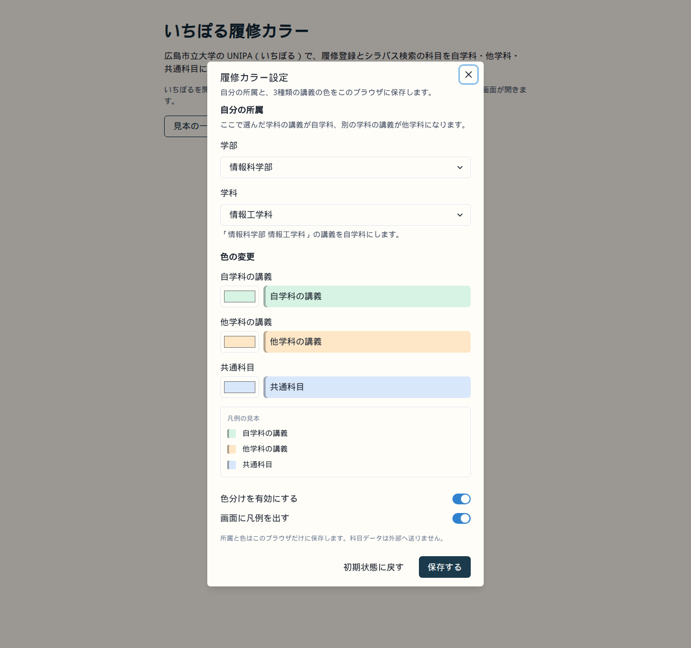
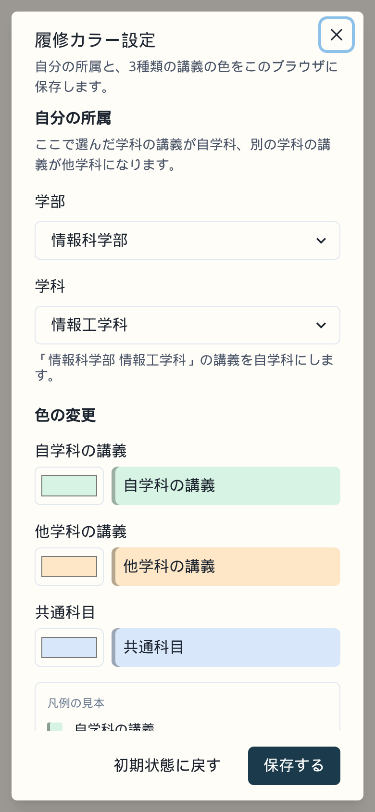
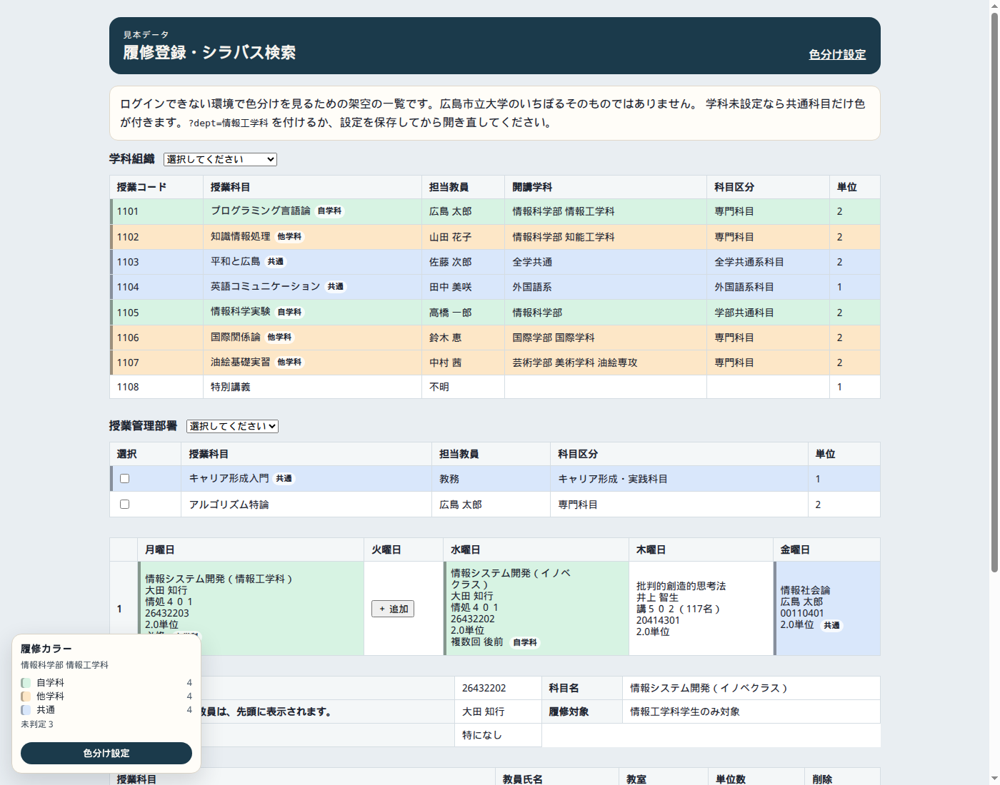

# いちぽる履修カラー

広島市立大学の UNIPA（いちぽる / UNIVERSAL PASSPORT RX）で、履修登録とシラバス検索の科目を色分けする Chrome 拡張機能です。

- 自学科
- 他学科
- 共通科目（全学共通・教養・外国語系など）

設定画面は Chakra UI のモーダルです。判定も保存もブラウザの中だけで完結します。

## プライバシー

この拡張は、科目データ・ページの内容・クッキーを、開発者のサーバを含む第三者へ送りません。

- 計測、遠隔の設定取得、外部フォント、CDN はありません
- 設定は `chrome.storage.local` に保存します
- 科目のキャッシュは `chrome.storage.session`（ブラウザを閉じると消える）に、取り出した項目だけを残します
- ネットワークを見る処理は、いちぽる自身が行った同一オリジンの応答を読むだけです
- 行のリンク先を追加で開く処理は動きません。今見ている表と、ページ自身が受け取った同一オリジンの応答だけを使います

## インストール

```bash
npm install
npm test
npm run build
```

1. Chrome で `chrome://extensions` を開く
2. デベロッパーモードをオンにする
3. 「パッケージ化されていない拡張機能を読み込む」で、このリポジトリの `dist/` を選ぶ
4. セッションのある履修登録（`/uprx/up/**/*.xhtml`）を開くと色が付く
5. ツールバーのアイコン、または画面左下の「色分け設定」から学科を保存する

この拡張はログインしません。認証の入口は `https://ichipol.g.hiroshima-cu.ac.jp/uprx/ShibbolethAuthServlet` です。セッションがない状態で画面の奥の URL を開いても通りません。別の場所でログインすると、こちらのセッションが切れることがあります。

設定を変えたあとは、開いている一覧にそのまま反映されます。反映されないときはページを再読み込みしてください。

## 学科の設定

設定モーダルの「自分の所属」で、学部と学科を選びます。候補は公開されている学修の手引き（2024年度入学生版）の学部構成です。

- 国際学部: 国際学科
- 情報科学部: 情報工学科 / 知能工学科 / システム工学科 / 医用情報科学科
- 芸術学部: 美術学科（日本画・油絵・彫刻）/ デザイン工芸学科

一覧に無い名称は「その他（手入力）」から入れます。選んだ学科の講義が自学科、別学科の講義が他学科になります。所属が空のあいだは、共通科目だけ色が付きます。学科を空にして学部だけ選ぶと、その学部だけで開講されている科目を自学科にします。

## 色の変更

モーダルの「色の変更」で、次の3色を選べます。

| 項目 | 初期の色 | 意味 |
| --- | --- | --- |
| 自学科の講義 | 緑 | 設定した学科と開講学科が一致 |
| 他学科の講義 | 橙 | 開講学科が自分の学科と異なる |
| 共通科目 | 青 | 全学共通・教養・外国語系など |

凡例の見本が、選んだ色ですぐ変わります。「画面に凡例を出す」をオフにすると、履修一覧の左下の凡例だけ隠れます。左端の線は背景色から自動で濃くします。

行にマウスを乗せると、なぜその色になったかの短い理由が出ます。

## 判定

上から順に決めます。設定画面で変えるのは所属と色です。

1. 保存データに上書きルールが残っていれば、それが先
2. 共通・教養・全学共通・外国語系・一般情報処理・保健体育・キャリア形成などの標識
3. 開講学科が、設定した学科と一致 → 自学科
4. 学科名がなく、設定した学部だけの開講 → 自学科
5. 開講所属が取れて、一致しない → 他学科
6. それ以外 → 未判定（色を付けない）

「学部共通科目」は全学の共通科目にしません。情報科学部の学生にとっての学部共通は、学部開講として扱います。

学科名のゆらぎ（空白、`情報科学部情報工学科` のような連結）は吸収します。専攻まで設定した場合、別専攻は他学科、専攻が書かれていない同じ学科の科目は自学科です。

開講学科が画面に無い科目は、推測で他学科にしません。上書きルールか、下の「画面から読むもの」で埋まったときだけ色が付きます。

## 仮のセレクタ

実画面の列名はまだ仮です。差し替え口は `src/content/selectors.ts` です。Unipaヘルパーがログイン済みの履修登録（URL、表の構造、列名、同一オリジンの XHR）を渡したあと、次を実測に合わせます。

| 項目 | 仮の見方 | 更新する場所 |
| --- | --- | --- |
| 開講学部・学科 | 見出し「開講学部・学科」「開講学科」「学科組織」「開講学部」 | `HEADER_FIELDS` の department / faculty、`LIVE_ATTRIBUTE_HOOKS` |
| 科目区分 | 見出し「科目区分」「授業管理部署」 | `HEADER_FIELDS` の division |
| 共通科目 | セル文言の「全学共通」「教養」「共通科目」など。`kyotsuFlg` | `COMMON_TEXT_PATTERNS`、`JSON_FIELD_KEYS` |

`LIVE_TABLE_SELECTORS.courseTable` と `LIVE_ATTRIBUTE_HOOKS` は空です。空のあいだは `table` の見出し文言で判定します。実測の CSS セレクタや `data-*` が分かったら、その配列だけ足します。

## 画面から読むもの

次の順に見ます。列名は仮です。

1. 表の見出し
   - 授業コード / 科目コード
   - 授業科目 / 科目名
   - 担当教員
   - 開講学科 / 学科組織 / 開講学部・学科 / 開講学部
   - 科目区分 / 授業管理部署
2. 見出しに学科列が無い表だけ、同じフォームの「学科組織」「授業管理部署」の選択値（「選択してください」「すべて」は無視）
3. 曜日の時間割マス。科目名が、同じ画面か直前までの応答で分かっている科目と一致するとき
4. ページ自身の `fetch` / `XMLHttpRequest` 応答
   - JSON に `jugyoCd` `jugyoName` `gakkaName` `kyotsuFlg` のような項目があるとき
   - JSF / PrimeFaces の `partial-response`（`update` の CDATA に入った HTML）
5. 設定をオンにしたときだけ、行の中の同一オリジン GET（`/uprx/**/*.xhtml?…`）。`javascript:` リンクは開きません

画面の形は、公開情報と UNIPA RX の一般的な構造からの仮です。機能コードは実測待ちです。

- ホスト: `https://ichipol.g.hiroshima-cu.ac.jp`（旧表記の `ichipol.hiroshima-cu.ac.jp` と `*.g.hiroshima-cu.ac.jp` も対象）
- 認証の入口: `https://ichipol.g.hiroshima-cu.ac.jp/uprx/ShibbolethAuthServlet`（この画面では色分けしません）
- ログイン後の JSF は `/uprx/up/**/*.xhtml`。PrimeFaces の `ui-datatable` を想定しています
- 大学サイト全体（`www.hiroshima-cu.ac.jp` など）には入れません

第三者が叩く非公開 API は見つけていません。拡張から新しいバックエンドも作っていません。

## 開発

```bash
npm install
npm test
npm run dev
```

開発サーバは設定画面と見本一覧を出します。見本は架空の科目です。

- 設定: http://127.0.0.1:43123/
- 見本: http://127.0.0.1:43123/demo.html?dept=情報工学科

`npm run build` は型チェックとテストのあと、`dist/` に拡張機能を出します。

## 画面

設定モーダルと、見本一覧への色分けです。実物のいちぽるは学内ログインが必要なため、スクリーンショットはローカルの見本です。



狭い画面では同じモーダルが画面いっぱいになります。





## 構成

- `src/shared/classify.ts` — 判定
- `src/content/selectors.ts` — 仮の見出し・属性・JSON キー。実測が来たらここを更新する
- `src/content/` — 一覧の検出、色付け、同一オリジン応答の観測
- `src/settings/` — Chakra UI の設定モーダル
- `src/background/index.ts` — ツールバーから設定を開く
